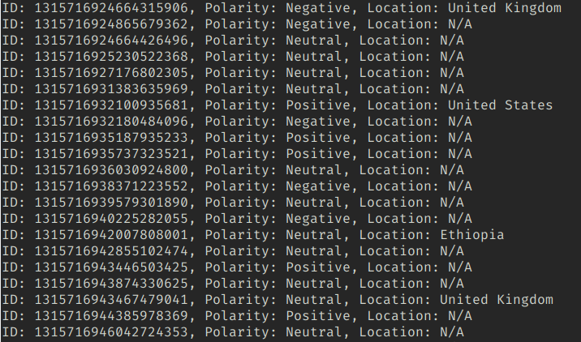

# Twitter Sentiment Analysis

> It is important to know that this is just purely proof-of-concept and a way for me to have a play with Python and the Tweepy library.



## Setup and Configuration
```bash
$ git clone https://github.com/jackcoble/sentiment-analysis.git
$ cd sentiment-analysis/
```

Now you need to edit the sample environment variable file so that it contains your credentials for the Twitter API.

```bash
$ cp .env.sample .env
```

## Running with Docker
Because Python wreaks havoc with my machine, I went for the simple way of running the project using Docker. To get started, just execute the following commands:
```bash
$ docker build -t sentiment-analysis .
$ docker run -it sentiment-analysis
```